# Як воно — там?

Що чекає «в реальній роботі», і що варто вчити вже за часів коледжу

<!--
**Таймер**

Задінемо:
- Речі які саме від коледжу в роботі дали плюс.

Якщо виникнуть питання:
- можна буде підняти руку (гукнути), і озвучити
-->

---

# Хто я

<b>Yevhen Sidelnyk</b> · Backend Developer

at Stfalcon

<ul class="pt-1 text-3xl">
<li>Stfalcon (2023-now)</li>
<li>Smile (2021)</li>
<li>Snotor-MMG (2020)</li>
</ul>

Буду говорити більше за бекенд (не все буде для всіх)

---

## Проекти

<ul class="list-none">
<li><b>Нова Пошта</b> — кабінет співробітника</li>
<li><b>Lactalis</b> — B2B e-commerce магазин</li>
<li><b>RAF AG</b> — цивільна авіація США</li>
<!-- невеликі доробки -->
</ul>

<b>Stack:</b> PHP, Symfony, PostgreSQL

<!--
Над якими працював (чіпляють)

1. 300k of code
2. 9+ орг в різних країнах
3. "кнопку перефарбував", але авіац.

-->

---

<h3 class="pt-2">@rela589n</h3>

(relation)

---

---

# 1. Як все починається?

<!--
як потрапляємо на роботу

почули про компанію (dou), і...
-->

---

## 👨‍💼 Interview

(або практика)

---
layout: image
image: ./assets/Interview.jpg
---

<!--
Чоловік запитує що знаєш, що вмієш
-->

---

## Що було в моєму випадку

Вже були знання Laravel та OOP, які я дізнався з курсів та книжок.
 Я їм дуже сподобався👍

---

## Порада #1.1

<b>Вивчайте, самі.</b>

Якщо йдете працювати / стажуватись на PHP / Python / Java,  то чим більше знаєте, тим краще.
 

---

#### Як вивчав я?

Курси (~щодня)

Книжки

Практичні

<!--
- Курси по PHP - історія з історією.
- Книжки - для якості коду.
-->

---

### Чому PHP?

Спочатку я вчив Python. 
Але на той час по вакансіях — не густо. 
Перейшов на PHP.

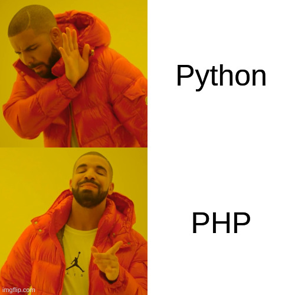

<!--
Зараз - ситуація протилежна

PHP
- Мова - дуже хороша, якщо писати добре (Symfony)
- Багато підходів - з Java та Spring
-->

---

## Порада #1.2

Дивіться на <u><i>перспективність</i></u>, <u>що подобається</u>, і <u>актуальність</u>,   і пробуйте з цим робити лаби, курсачі

---

### hpk-test

<ul>
<li>Зробив пет-проект на Laravel</li>
<li>
Налаштував Docker

(Без нього на backend — ніяк)

</li>
<li>Здав його на: курсач, курсач, диплом</li>
</ul>

<!--
курсовий
-->

---

### 2. Перший раз потрапляєш на проект

<!-- Після інтерв'ю -->

---
layout: image
image: ./assets/Homer-Panic.png
---

<!--
ось така ситуація
-->

---

## В чому проблема?

(P.S. не тільки перший проект.)

---
src: ./slides/project-problems.md
---

---

<h3>Робіть мені гарно, а некрасиво не робіть</h3>

<!--
Звучить добре, але вимоги неопрацьовані:
- Не завджи є BA.

Питання за конкретику:
- перед реалізац;
- під час реалізації.

Що ми можемо зробити?
-->

---

### Порада #2.1

Вчитись <u>з'ясовувати</u> питання (<u>говорити</u>, <u>комунікувати</u>).

<blockquote>

Не задає питання не той кому все зрозуміло,  а хто не готовий комунікувати

</blockquote>

Візьміть за звичку більше проговорювати що не розумієте.

<!--
Етап моделювання.

Комунікація:
- Перша відповідь
- Студницька, математика
- Викликатись першим на екзамен
-->

---

<h3>Що використовувати для проектної комунікації?</h3>

- просто говорити, ні?

<!--
не зрозуміють, сам заплутаєшся

Домовитись з іншою системою для синхронізації даними:
- анкети (і там, і там)
- отримання даних

Можна скинути на них:
- але тоді будьте готові працювати з тим

Для спрощення комунікації...

-->

---

<h4>Що використовував я:</h4>

<ul class="text-4xl">
<li>Lucid Chart - діаграми</li>
<li>Excel (google sheets) - багато чого</li>
</ul>

І також Word (Google Docs)

<!--
Word - коли якийсь звіт замовнику (аналіз).

Почнемо з хорошого...
-->
---

<h5>Lucid Diagrams</h5>

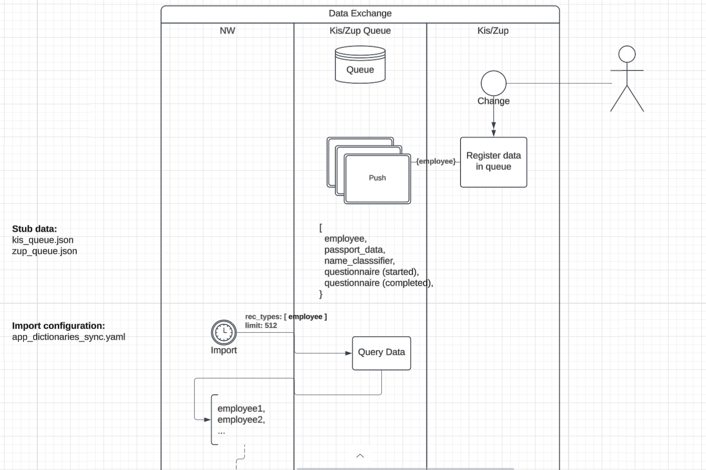

<!--
"та нащо мені ті діаграми, я код пишу?":
- людина не може пояснитись

код може AI писати
- а спроектувати систему не завжди

\<\- погодити обмін даними

проходимось по діаграмах під час дзвінка:
- під час дзвінка вони змінюються

-->

---

##### Excel-обговорення

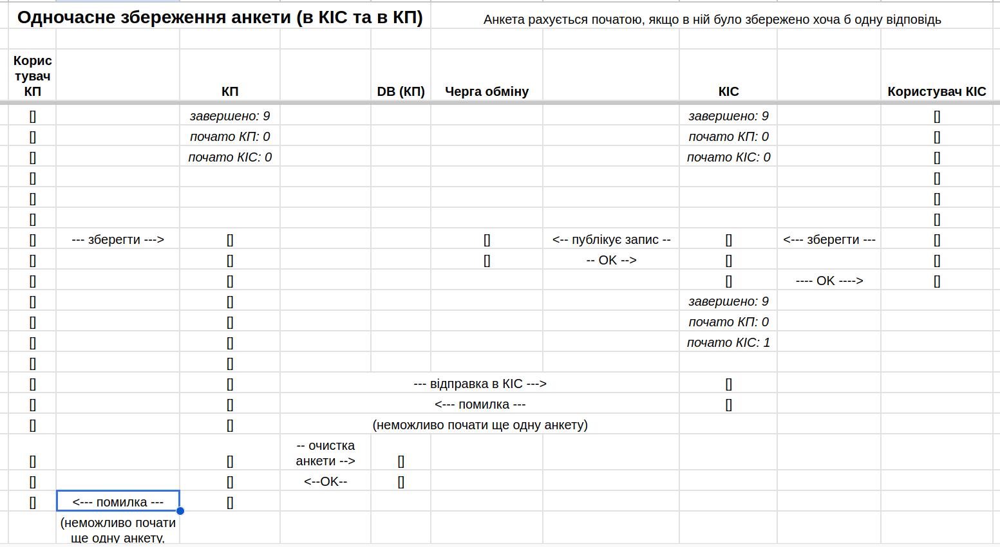

<!--
не старався малювати діаграми в коледжі "як для роботи" - вже на роботі не є часу

ситуація:
- анкетування - усього заповнити *10 анкет*
- вже пройдено 9, і будуть починати 10-у
- анкети можуть бути заповнені: \* *з нашої* ; \* *з сторонньої* системи

Гарантувати обмеження, що не заповнить 2 рази

проблема що вирішується - щоб тебе зрозуміли
-->

---

<h3>Та тут все зрозуміло...</h3>

(а воно величезне)

---

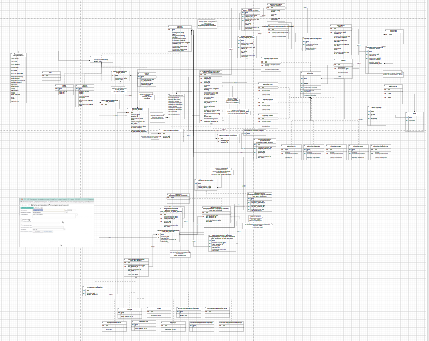

P.S. не робіть так

<!--
проблема, - дійшли розуміння, але з цим важко працювати
зворотня сторона медалі: [немає діаграми, всевмісна діаграма]
-->

---

<h5>Замість великої діаграми:</h5>

Краще розділити на менші діаграмки  (навіть вкладками в тому ж документі)

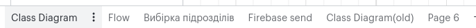

---

<h3>Домовленість з іншою командою</h3>

Треба інтегруватись, але ні в них, ні в нас нічого немає

(потрібно розробити)

<!--
мають розробити щось для нас (для них),
- але треба домовитись щодо даних

В найбільшому варіанті інтегрували 3 системи в один ф-л.
-->

---

<h3>Excel</h3>

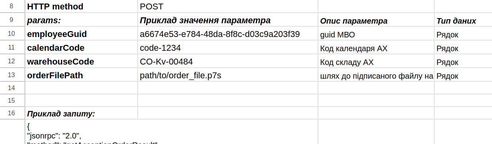

---

<h3>Тут роботи на декілька місяців...</h3>

Як щось не упустити?

---

<h4>Декомпозиція</h4>

(і оцінка)

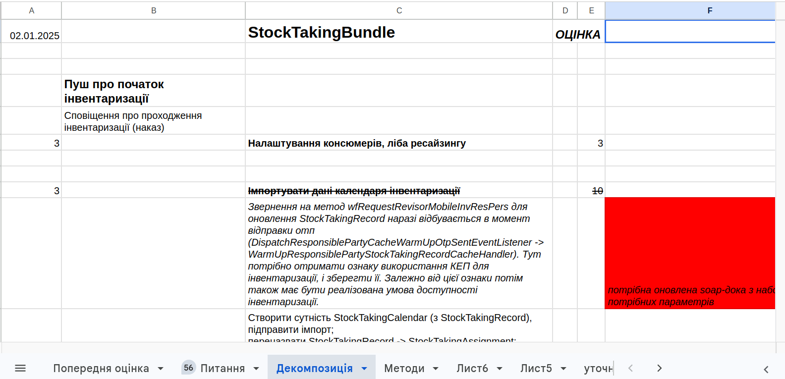

<!-- розумне слово для "розділення великої задачі на маленькі задачі" -->

---
src: ./slides/project-problems.md
---

---

    <h3 class="text-center">Код не дуже?</h3>
    

---

### Таке трапляється...

(частіше ніж хотілось би)

<!--
І це на всіх мовах.

Причина - погано написаний код.
-->

---

<h4>Як результат — складність роботи з ним</h4>

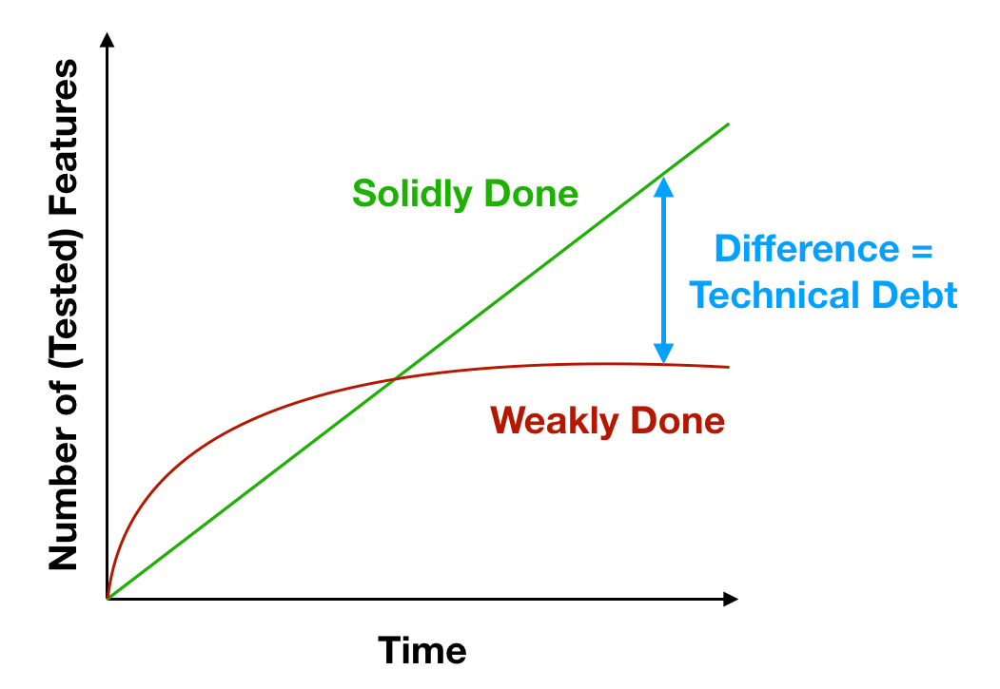

<!--
\<\- і на це йде більше часу

- червоне - неякісно
- зелене - якісно
-->

---

<h3>Основна проблема коду —</h3>

коли він не відображає те, що він робить

<!--
Для того, щоб самому *писати якісно* (виправляти ситуацію)...
-->

---

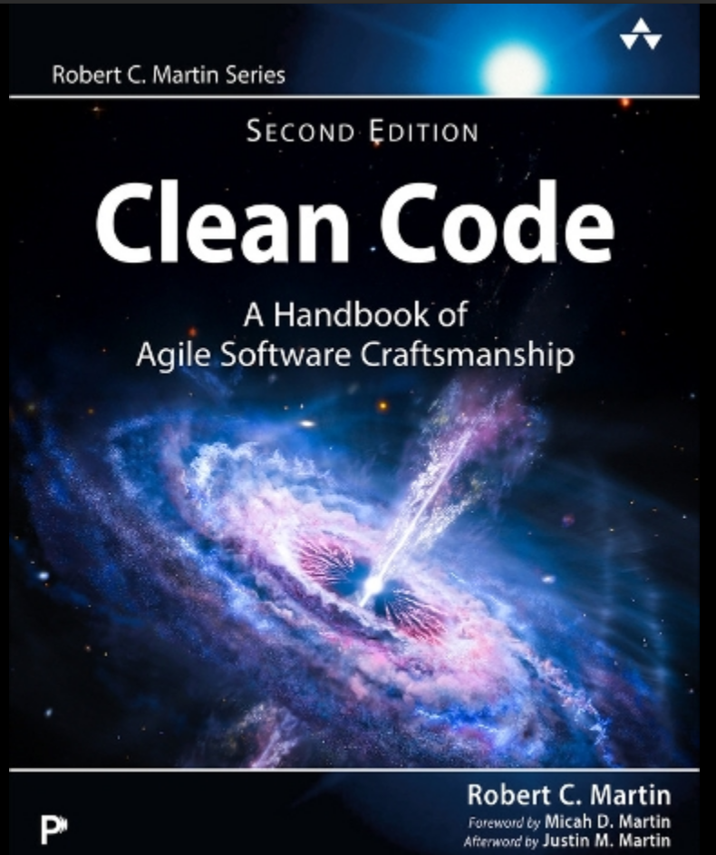

<!--
базові речі

\-Clean Architecture -> \+DDD
-->

---

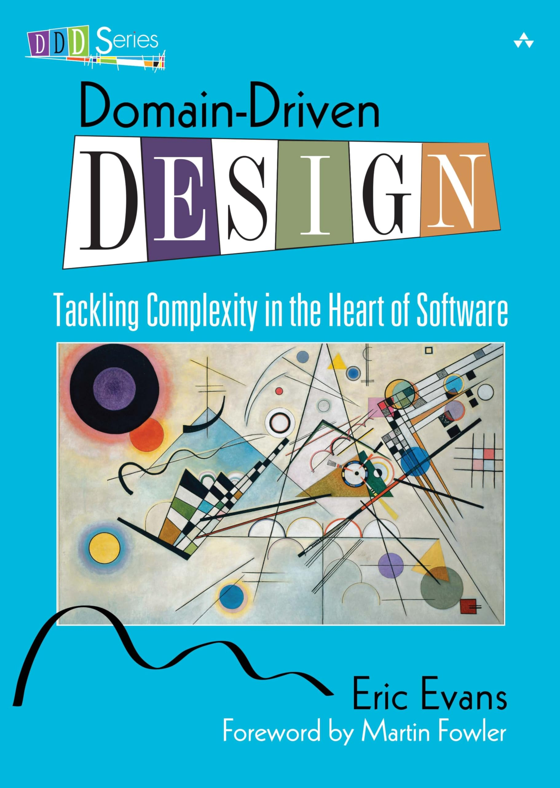

<!--

архітектурна, дизайн

супер:
- комунікація (діаграми)
- моделювання

-->

---

<h3>Тут і зараз — треба розібратись</h3>

---

> допоможи будь ласка розібратись з кодом 

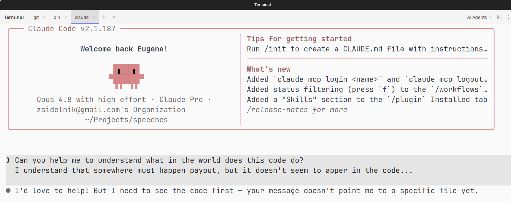

<!--
AI - добре знаходить речі
-->

---

### "AI там сам розбереться"

<ul class="-mt-4 text-3xl">
<li>💯, але відповідальність на вас</li>
<li>AI не знає замовника, і не спроектує систему</li>
</ul>

<blockquote>

AI пише не краще, чим вже є.

</blockquote>

<!--
- Чим краще проект вже написаний, тим краще AI допомагає.
- Чим гірше проект написаний, тим ще гірше AI буде його дописувати.

Якщо є сумніви...
-->

---

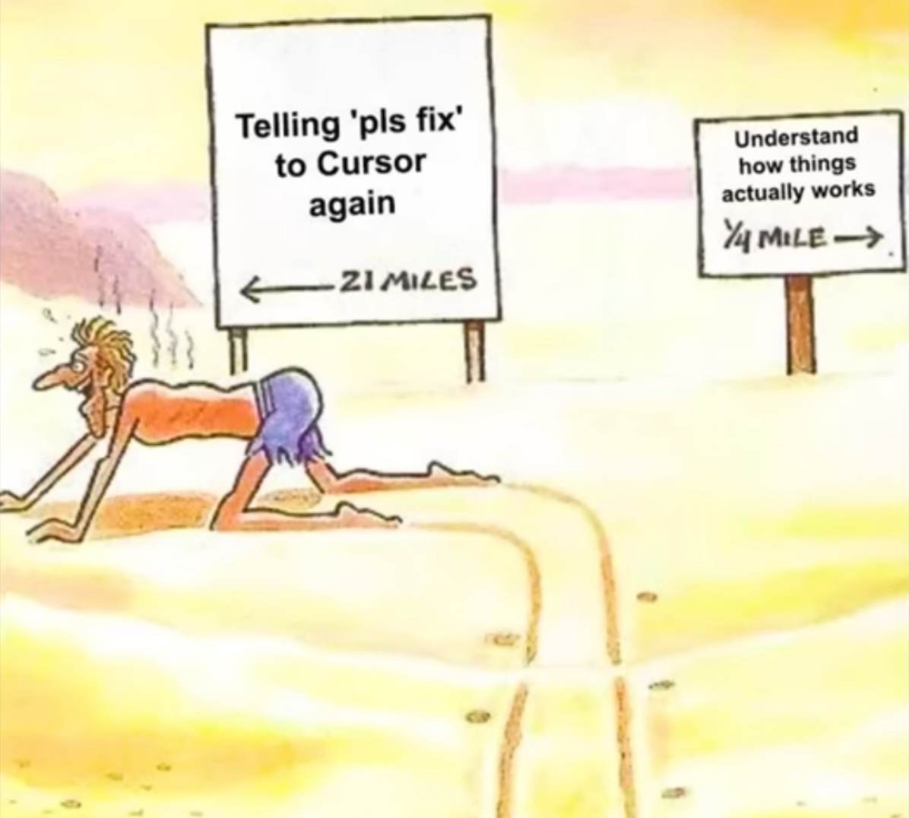

AI, виправ, будь ласка - 21 миля ; Зрозуміти головою - 1/4 милі

---

## Порада #2.2

<b>Вивчайте</b> <i>як речі</i> <b>фундаментально</b> <i>працюють</i>.

І пишіть якісно.  (вже, а не чекаючи коли потрапите на проект)
 

---
src: ./slides/project-problems.md
---

---

<h2>Недостатня експертиза</h2>

---

## Порада #2.3

<b>Вивчайте:</b>

<ul>
<li>Стек з яким працюватимете</li>
<li>Патерни моделювання</li>
<li>Алгоритми і структури даних</li>
</ul> 

<!--
Алгоритми - зворотний обхід графа.

Патерни моделювання...

"не дають, що в реалі..."
- ніхто не дасть, якщо не брати
-->

---

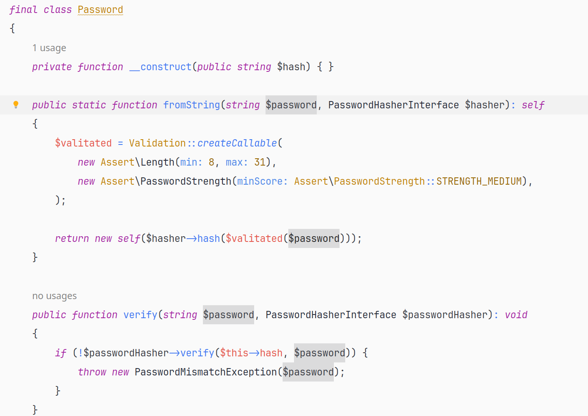

<!--
OOP (DDD) - об'єкт з логікою

дізнався - falshback
-->

---

---

### 3. Потрапляєш на іноземний проект

---

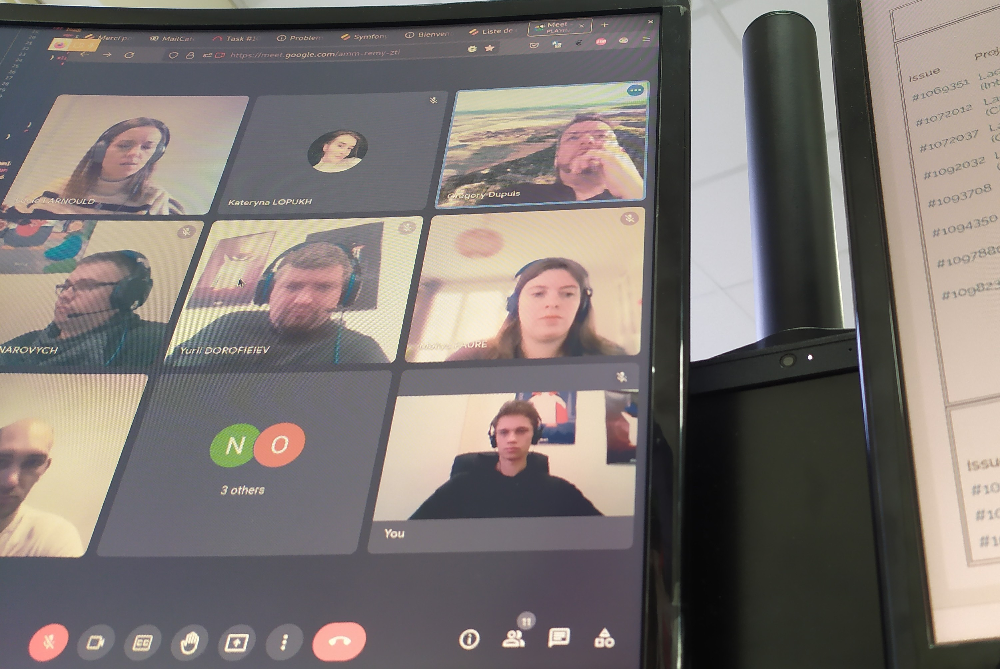

Тут треба говорити...

<!--
якщо не вчили англ...
-->

---

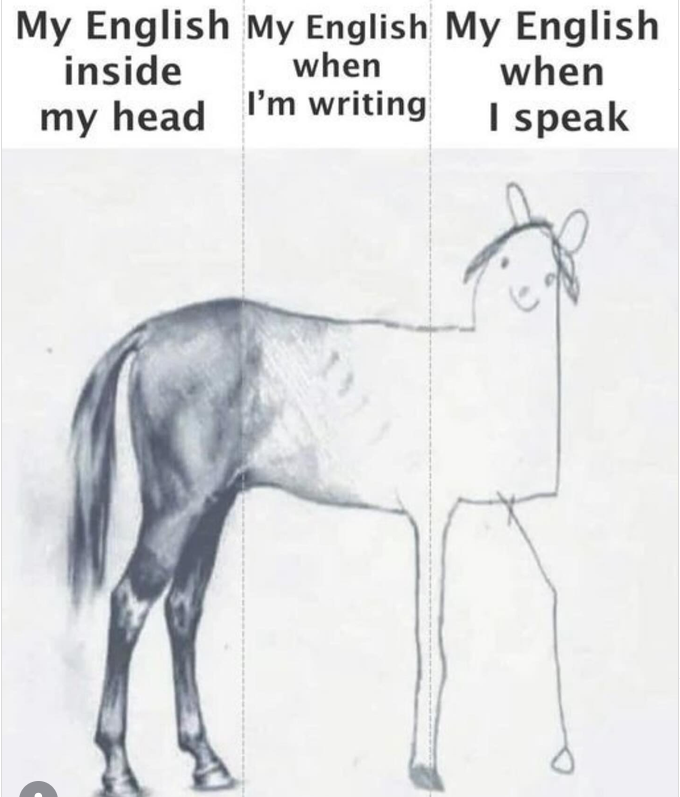

---

## Порада #3

<b>Вивчайте англійську:</b>

<ul>
<li>Телефон на англійську</li>
<li>Відео на англійській</li>
<li>Читайте на англійській</li>
<li>Виписуйте собі нові слова які вам сподобались</li>
</ul>
<blockquote>

PRO-tip: замість перекладача використовуйте  англ. словник (визначення)

</blockquote>

<!-- Словник - розуміння -->

---

<h2>Ітого</h2>

<ul>
<li>Вивчайте стек з яким хочете мати справу, пишіть якісно вже</li>
<li>Вчіться комунікувати</li>
<li>Вивчайте англійську</li>
</ul>

<!--
1. не об'єктивна міра що код добре зроблений, а суб'єктивний підхід "робимо добре"
2. діаграми, excel, - "як ніби вже на роботі"
3. практично
-->

---

<h3>Притча про Жолудь</h3>

<blockquote>

Скіл — це як жолудь, що проріс.   
Кожного окремого дня росту не видно,  але з часом він стає міцним дуб що не хитається.

</blockquote>

---

<h2>Дякую за увагу</h2>

---

<h2>Bonus tip</h2>

(на літо)

---

<h4>Десятипальцевий друк</h4>

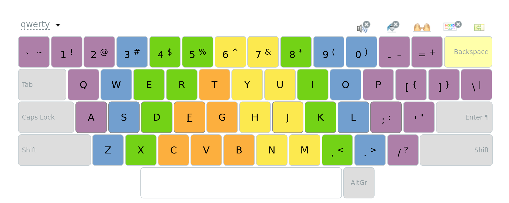

<!--
Потім на це не буде дуже багато часу
-->

